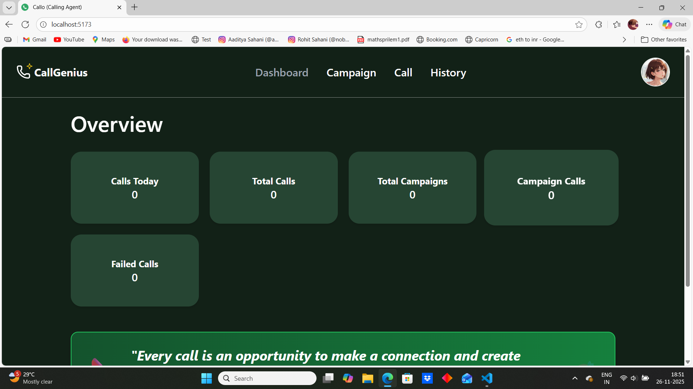
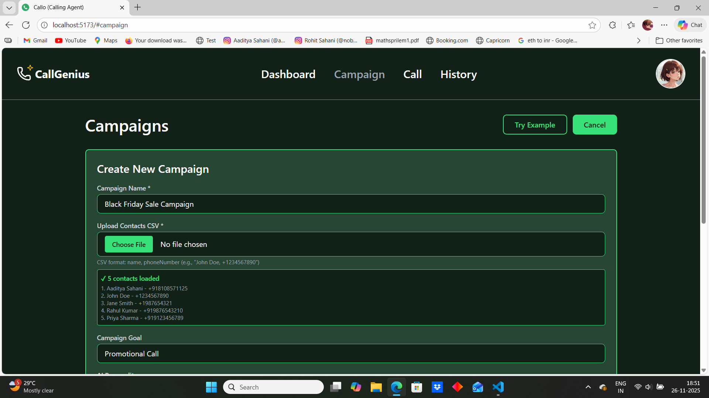
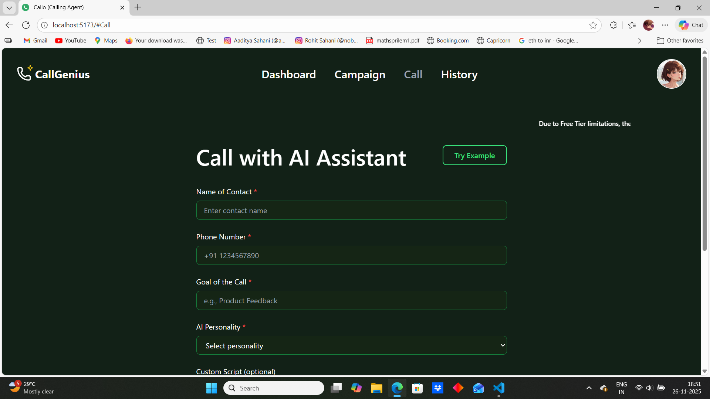
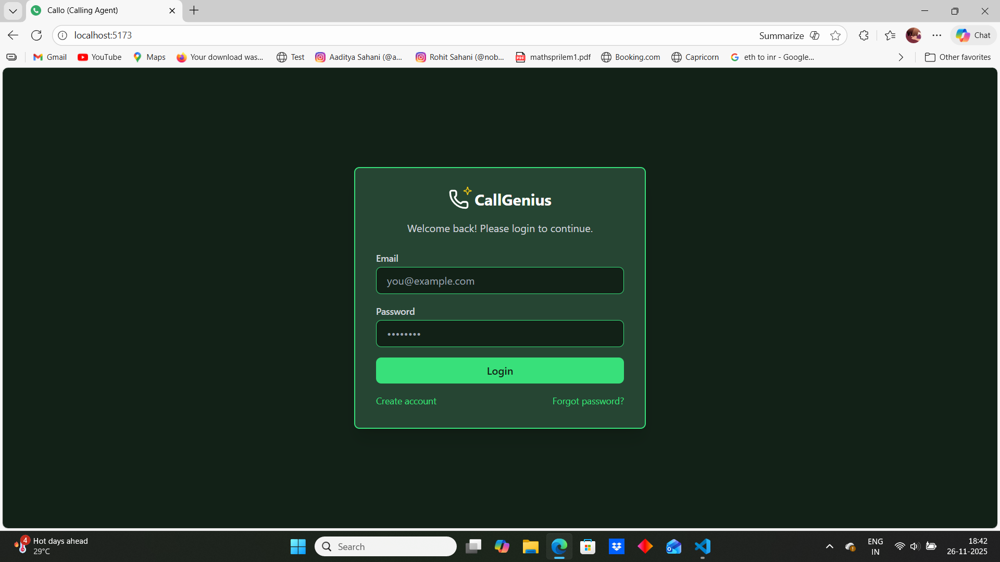
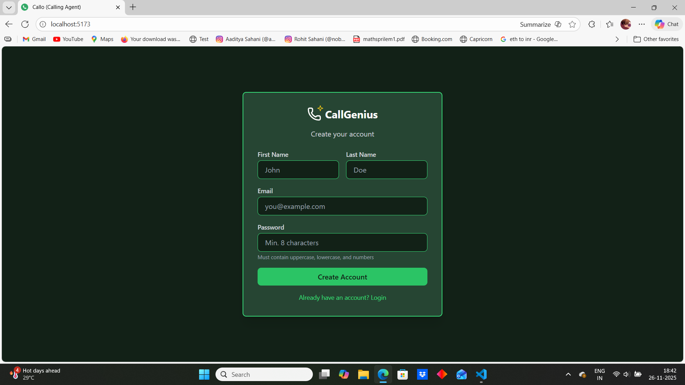

# Calling Agent

Calling Agent is an open-source AI voice campaign manager that connects a web frontend with a Node.js server to run automated calling campaigns using Twilio, AWS speech services, and optional AI integrations.

**Note on Costs:** Calling Agent uses AWS services (Polly, Transcribe, Bedrock/LLMs, S3) and third-party APIs (Twilio, Google). These services may incur charges in your account. No live hosted site is provided here — you must provision and pay for any cloud services used. Use free tiers where available and monitor usage closely.

**Logo**: Place your Calling Agent logo image at `frontend/public/images/logo.png` (the UI will pick it up from there). If you have an SVG or PNG, name it `logo.png` and put it in that folder.

**Contents**
- `server/` — Node.js backend (Express) and integrations (Twilio, AWS, MongoDB)
- `frontend/` — Vite + React UI
- `server/.env.example` and `frontend/.env.example` — example env files (do NOT store real secrets in repo)

**Quick Features**
- Create and run voice campaigns using Twilio
- Use AWS Polly/Transcribe for TTS/STT
- Supports Google/AI integrations for dynamic script generation
- Stores call history in MongoDB

**Prerequisites**
- Node.js (v18+ recommended) and `npm`
- An AWS account (for S3, Polly, Transcribe, Cognito, etc.)
- A Twilio account with a verified phone number
- MongoDB Atlas or another MongoDB instance

**Getting Started (local)**
1. Clone the repo:

```powershell
git clone https://github.com/aaditya7788/Calling_agent-aws
cd Calling-agent
```

2. Install dependencies for the server and frontend:

```powershell
cd server
npm install
cd ..\frontend
npm install
cd ..
```

3. Create environment files from the examples and fill them in.

```powershell
Copy-Item .\server\.env.example .\server\.env
Copy-Item .\frontend\.env.example .\frontend\.env
```

Open `server/.env` and populate your keys (AWS, Twilio, MongoDB URI, etc.). See `server/.env.example` for the full list of variables.

4. Ensure you do NOT commit real secrets. This repository includes `.gitignore` rules for `.env` and `server/key.js`. Use `server/key.js.example` as a template only.

5. Run the server (development):

```powershell
cd server
npm run dev
```

6. Run the frontend (development):

```powershell
cd frontend
npm run dev
```

Open the URL printed by Vite (usually `http://localhost:5173`) and the backend at `http://localhost:3000` (or the port shown in server logs).

**Environment Variables**
Key server variables (examples are in `server/.env.example`):
- `TWILIO_SID`, `TWILIO_AUTH`, `TWILIO_PHONE`
- `MONGO_URI`
- `AWS_ACCESS_KEY_ID`, `AWS_SECRET_ACCESS_KEY`, `AWS_REGION`, `AWS_S3_BUCKET`
- `GEMINI_TOKEN` (or other AI keys)
- `COGNITO_USER_POOL_ID`, `COGNITO_CLIENT_ID`

Frontend environment variables live in `frontend/.env.example` and should be prefixed with `VITE_` for Vite to expose them to the client.

**Security & Secrets**
- Never commit `.env` or secret keys. Use `server/.env.example` for placeholders.
- Use environment variables in deployment platforms (Heroku/GitHub Actions/AWS ECS/Lambda) or a secrets manager (AWS Secrets Manager / Parameter Store).
- If you accidentally committed secrets, rotate/revoke them immediately and consider purging history (BFG or `git filter-repo`).

**Limitations**
- AWS and third-party APIs may bill you — exercise caution when running large campaigns.
- This repo is a starter project: you should review all integrations and secure API credentials before production use.

**Contributing**
- Fixes and improvements are welcome. Open issues or PRs with a clear description of changes.

**License**
- Add your preferred license file (e.g., `LICENSE`) before publishing to GitHub.

Enjoy building with Calling Agent! If you'd like, I can also prepare a short CONTRIBUTING.md, a PR template, or help purge any confidential data from git history.

## Screenshots


### Dashboard


### Campaigns


### Call View


### Login


### Login / Signup

